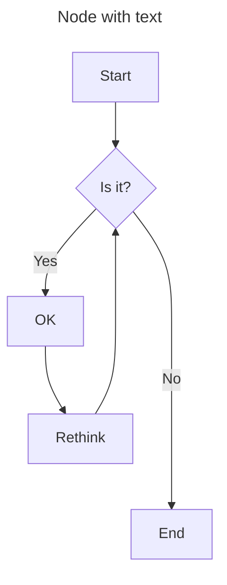
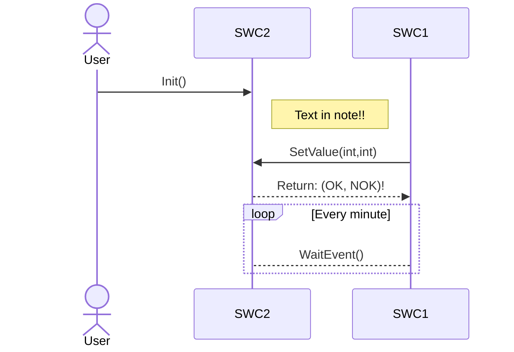
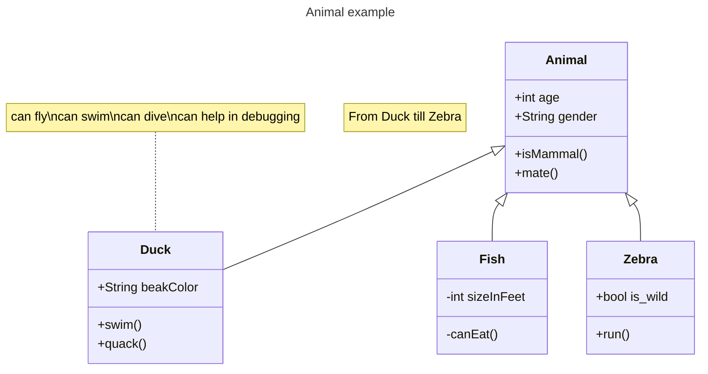
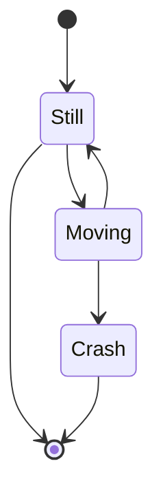
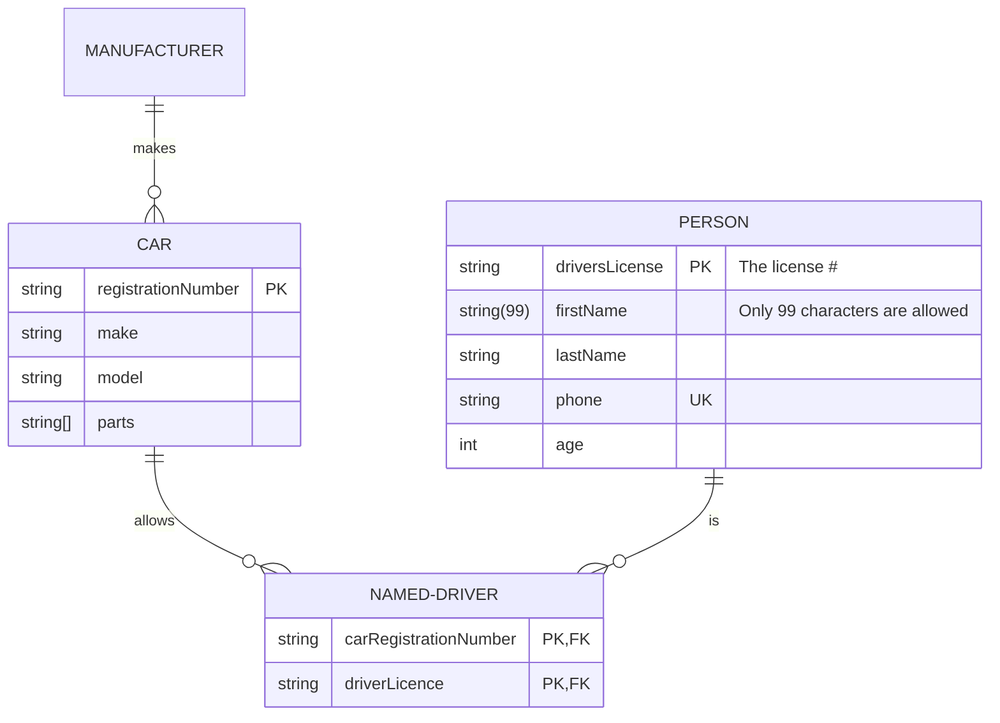
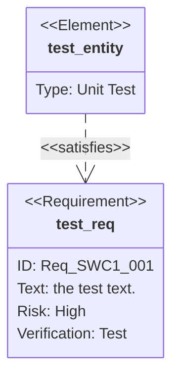
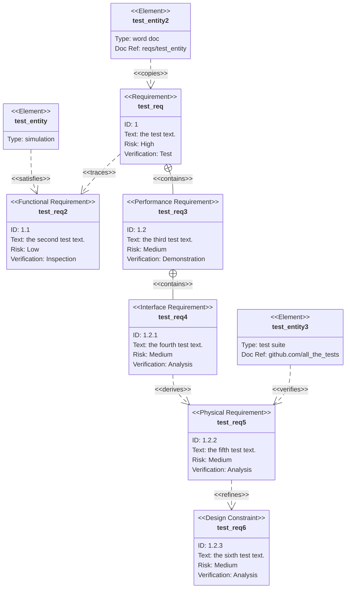
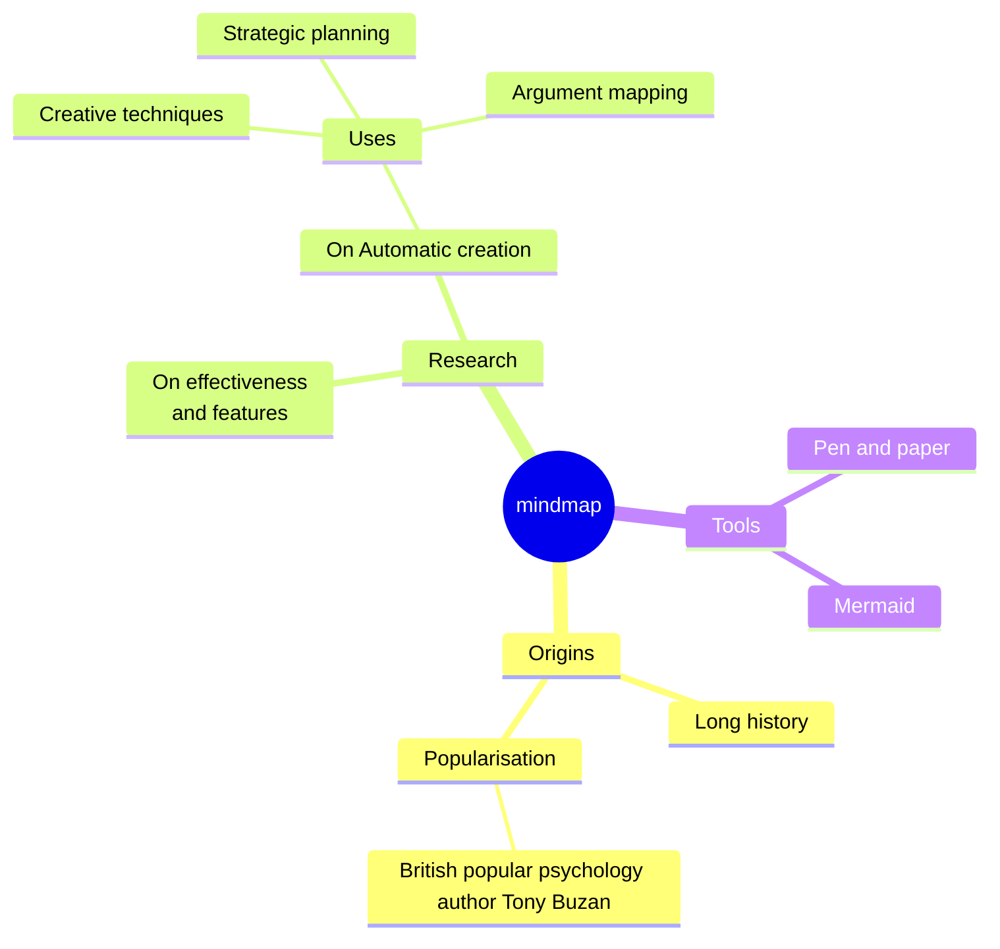

# MarkDown example

Here are some examples of Markdown file with live editing in VSCode

# 1. Flow Chart

***
---

# 2. Sequence Diagram

# 3. Class Diagram

# 4. state Diagram

# 5. Entity Relationship Diagram

# 6. Requirement Diagram

## 6.1. Requirement Test

##Req_ID: IOHAB_SWC_001

# 7. Mind Mapping

